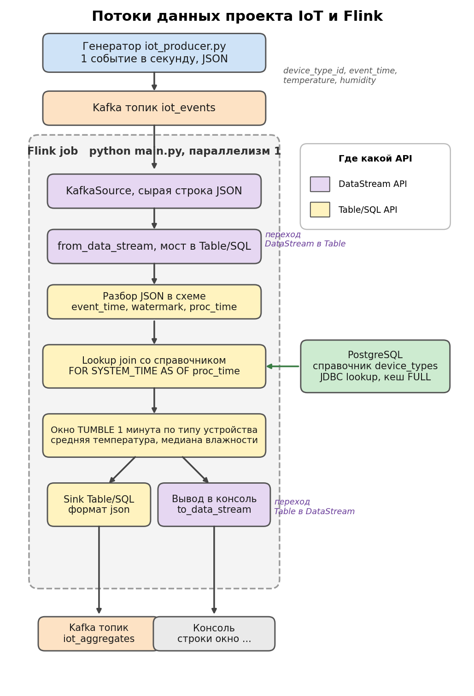

# Проект IoT и Flink

**В папке `docs` лежит `run_example.pdf`, готовый пример реального прогона с конкретными
значениями. Его можно открыть и сразу увидеть, как всё работает, без запуска системы.**

Я собираю поток событий от IoT-устройств, обогащаю его справочником типов из
PostgreSQL, считаю агрегаты в окне по одной минуте и пишу результат обратно в Kafka.

Поток такой. Генератор раз в секунду шлёт JSON в топик Kafka `iot_events`. Flink-job
читает этот поток, подтягивает к нему имя типа устройства из справочника PostgreSQL,
закрывает окно в одну минуту по event time и на каждый тип считает среднюю температуру
и медиану влажности. Результат уходит в топик `iot_aggregates` и заодно печатается в
консоль. Внутри job есть оба API, DataStream и Table/SQL, и явный переход между ними.

Ниже по шагам, что поставить и как запустить. Команды даю для Windows PowerShell и для
Linux или macOS.

## Схема потоков данных



Сверху вниз по схеме. Генератор `iot_producer.py` шлёт события в топик `iot_events`.
Flink-job читает топик как DataStream через `KafkaSource`, переводит поток в Table через
`from_data_stream` (это первый переход между мирами API). В схеме источника разбираю
JSON, достаю `event_time`, ставлю watermark и `proc_time`. Дальше lookup join со
справочником `device_types` из PostgreSQL по `device_type_id`. Потом окно TUMBLE на одну
минуту по типу устройства, средняя температура и медиана влажности. Результат пишу в
топик `iot_aggregates` через Table/SQL sink, и тот же поток перевожу обратно в DataStream
через `to_data_stream` и печатаю в консоль (второй переход между мирами API). Фиолетовым
на схеме отмечены узлы DataStream, жёлтым узлы Table/SQL.

## Структура репозитория

| Путь | Зачем |
|------|-------|
| `main.py` | Точка входа. Готовит справочник в PostgreSQL, создаёт выходной топик, поднимает генератор, собирает граф Flink и запускает обработку |
| `iot_producer.py` | Генератор событий IoT, раз в секунду шлёт JSON в топик Kafka |
| `config.py` | Настройки в одном месте, адреса Kafka и PostgreSQL, имена топиков и таблиц, параметры окна |
| `ddl.sql` | Создание справочника `device_types` в PostgreSQL |
| `dml.sql` | Наполнение справочника пятью типами устройств |
| `docker-compose.yml` | Поднимает Kafka в режиме KRaft и PostgreSQL |
| `requirements.txt` | Версии Python-зависимостей для запуска |
| `pipeline/sources.py` | Источники, Kafka как DataStream и справочник PostgreSQL через JDBC |
| `pipeline/transforms.py` | Lookup join со справочником и оконные агрегаты |
| `pipeline/sinks.py` | Запись агрегатов в Kafka и вывод в консоль |
| `pipeline/job.py` | Сборка всего графа из источников, обогащения, окна и приёмников |
| `jars/` | Jar-коннекторы Flink, Kafka, JDBC и драйвер PostgreSQL |
| `docs/dataflow.png` | Схема потоков данных |
| `docs/run_example.pdf` | Готовый пример реального прогона с конкретными значениями |

## Что нужно поставить

- Docker Desktop. В нём поднимаются Kafka и PostgreSQL. Docker Desktop должен быть запущен.
- JDK 17. Нужен для встроенного JVM, на котором работает PyFlink. На Windows подойдёт
  портативный Temurin 17, на Linux или macOS любой JDK 17.
- Python 3.11. PyFlink 2.0 публикует колёса только до cp311, под Python 3.12 и новее их
  нет. Если в системе несколько питонов, окружение надо собрать именно из 3.11.

## Запуск по шагам

### Шаг 1. Поднять Kafka и PostgreSQL

```
docker compose up -d
```

Проверяю, что оба контейнера поднялись и здоровы.

```
docker compose ps
```

В колонке статуса жду `Up ... (healthy)` у `iot_kafka` и `iot_postgres`. Kafka слушает
`localhost:9092`, PostgreSQL опубликован на `localhost:5433` (порт 5433, потому что 5432
часто занят локальной установкой PostgreSQL).

### Шаг 2. Создать окружение Python 3.11 и поставить зависимости

Windows PowerShell

```
py -3.11 -m venv .venv
.\.venv\Scripts\Activate.ps1
pip install -r requirements.txt
```

Linux или macOS

```
python3.11 -m venv .venv
source .venv/bin/activate
pip install -r requirements.txt
```

В `requirements.txt` собрано всё, что нужно для запуска, PyFlink, клиент Kafka и драйвер
PostgreSQL.

### Шаг 3. Jar-коннекторы Flink

Jar-коннекторы уже лежат в папке `jars` в репозитории, качать или собирать ничего не надо.
Их версии перечислены в разделе про версии в конце, при желании их можно скачать вручную с
Maven Central, но для запуска это не нужно.

### Шаг 4. Задать JAVA_HOME

PyFlink ищет JVM по `JAVA_HOME`. Задаю его на текущую сессию терминала.

Windows PowerShell

```
$env:JAVA_HOME = "C:\путь\к\jdk-17"
```

Linux или macOS

```
export JAVA_HOME=/path/to/jdk-17
```

### Шаг 5. Запустить пайплайн

```
python main.py --with-producer
```

Одна команда делает всё. Применяет `ddl.sql` и `dml.sql` к PostgreSQL, создаёт выходной
топик, поднимает генератор отдельным процессом, создаёт окружение Flink и запускает
обработку. Флаг `--with-producer` поднимает генератор сам. Если хочется развести по двум
терминалам, можно в одном запустить `python iot_producer.py`, а в другом `python main.py`
без флага.

В консоли смотрю по порядку, что всё завелось. Опорные строки лога.

Справочник применился и наполнился.

```
справочник device_types наполнен, типов 5 [1 Датчик температуры, 2 Датчик влажности, 3 Климат-контроль, 4 Метеостанция, 5 Датчик температуры и влажности]
```

Генератор пошёл и раз в десять событий печатает сводку.

```
генератор запущен, шлю JSON раз в секунду в топик iot_events на брокер localhost:9092
за 30 секунд отправил 30 событий, темп около 22.0, влажность около 52.2, по типам id1 5 id2 5 id3 4 id4 7 id5 9
```

Flink прочитал справочник через JDBC и собрал граф по узлам.

```
через JDBC прочитал справочник из PostgreSQL, строк 5
источник событий собран, читаю топик iot_events из Kafka как DataStream (KafkaSource), перевожу в Table через from_data_stream
обогащение собрано, вид enriched_events, lookup join событий со справочником по device_type_id
окно собрано, вид aggregates, tumble 1 мин по event time, считаю среднюю температуру, медиану влажности и число событий по типу
приёмник Kafka собран через Table/SQL, пишу в топик iot_aggregates, формат json
граф пайплайна собран целиком, запускаю обработку, жду закрытия окон по event time
```

Дальше жду чуть больше минуты. Окно работает по event time, первое закрывается примерно
через минуту с небольшим запасом. Когда окно закрывается, в консоль идут строки агрегатов,
по одной на тип устройства.

```
+I[окно 20:17 тип Метеостанция событий 16 средняя темп 22.8 медиана влажн 50.2]
+I[окно 20:17 тип Датчик температуры событий 12 средняя темп 23.0 медиана влажн 50.6]
+I[окно 20:17 тип Климат-контроль событий 11 средняя темп 20.6 медиана влажн 40.4]
```

Останавливаю по Ctrl+C, генератор гасится сам. Прогон лучше держать на переднем плане и не
давать машине уснуть, иначе соединение с брокером рвётся по таймауту.

## Как проверить результат

Двумя способами.

### Способ 1. Вывод job в консоль

Это строки `окно ...` выше. Их печатает сам job через переход Table в DataStream, отдельный
консьюмер не нужен. Видно границу окна, тип устройства, число событий, среднюю температуру и
медиану влажности.

### Способ 2. Прочитать топик iot_aggregates

Те же агрегаты уходят в топик `iot_aggregates` как JSON. Самый простой способ прочитать его
консьюмером внутри контейнера Kafka.

```
docker exec -it iot_kafka /opt/kafka/bin/kafka-console-consumer.sh --bootstrap-server localhost:9092 --topic iot_aggregates --from-beginning
```

Или коротким консьюмером на Python из активированного окружения.

```
python -c "from kafka import KafkaConsumer; c=KafkaConsumer('iot_aggregates', bootstrap_servers='localhost:9092', auto_offset_reset='earliest', consumer_timeout_ms=5000); [print(m.value.decode()) for m in c]"
```

Пример строки из топика.

```
{"window_time":"20:17","device_type":"Метеостанция","avg_temperature":22.8,"median_humidity":50.2}
```

Поля `window_time`, `device_type`, `avg_temperature`, `median_humidity`. Значения совпадают
со строками в консоли, это один и тот же поток.

## Пример прогона

В `docs/run_example.pdf` лежит разбор реального прогона с конкретными значениями. Видно по
порядку, какие данные с какими числами куда идут, от наполнения справочника до строк
агрегатов в консоли и в топике.

## Кодировка консоли

На штатной русской консоли Windows (cp1251) кириллица читается и в логах Python, и в выводе
JVM. Если терминал в UTF-8, для ровного вывода нужно перевести консоль в UTF-8 и сказать то же
JVM и Python.

Windows PowerShell

```
chcp 65001
$env:JAVA_TOOL_OPTIONS = "-Dfile.encoding=UTF-8"
$env:PYTHONUTF8 = "1"
```

В самом коде кодировку не форсирую, иначе на cp1251-консоли вывод бы наоборот рябил.

## Про имя поля time

В задании поле границы окна называется `time`. У меня оно называется `window_time`. Это то же
самое, имя другое только чтобы не экранировать `time`, это ключевое слово в SQL. По смыслу это
начало минуты окна в формате `hh:mm`.

## Версии

- Python 3.11
- apache-flink 2.0.2
- kafka-python 2.3.2
- psycopg2-binary 2.9.12
- jar flink-sql-connector-kafka 4.0.1-2.0
- jar flink-connector-jdbc-core 4.0.0-2.0
- jar flink-connector-jdbc-postgres 4.0.0-2.0
- jar postgresql (драйвер) 42.7.5
- образ Kafka apache/kafka 3.9.2, режим KRaft без Zookeeper
- образ PostgreSQL postgres 17
- JDK 17, Temurin
